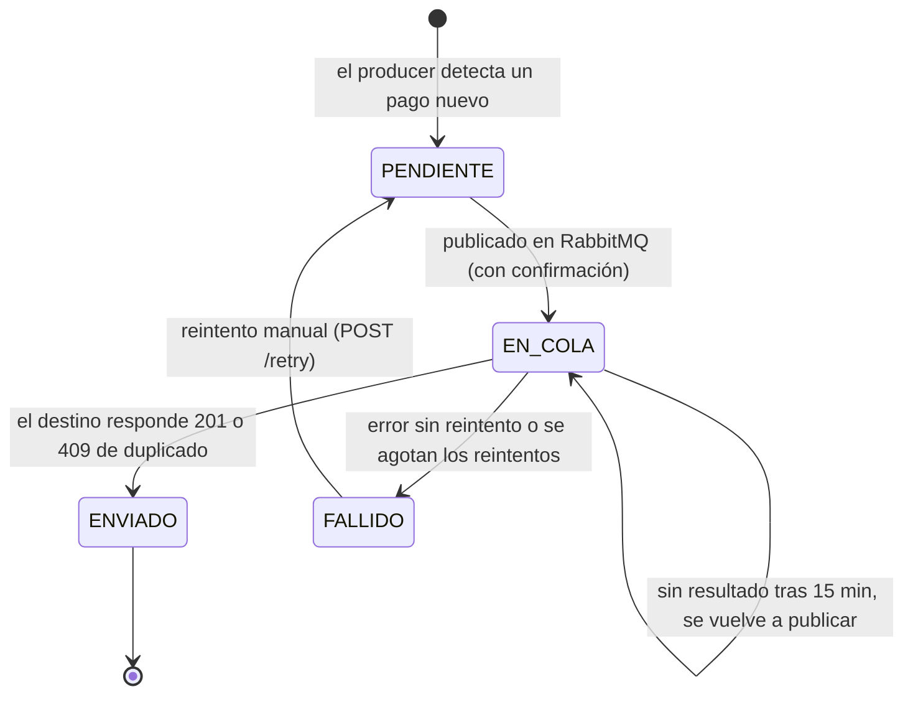

# Diseño del control de pagos pendientes y transmitidos 

Feature 3 · Envío de pagos a sistemas externos. Este documento define la tabla de control, los estados de un pago y cómo se evita enviar el mismo pago dos veces. **El monolito no se modifica.**

## 1. Resumen

- Cada pago registrado en el monolito se entrega a **dos destinos**: el banco y el ERP. Cada entrega se controla por separado.
- El control vive en un **esquema aparte** (`pagos_control`) dentro del mismo MySQL. Ninguna tabla de `oficina_agua` cambia.
- La tabla `transmisiones` tiene **una fila por (pago, destino)**, con su estado, sus intentos y el comprobante que devolvió el destino.
- **La idempotencia es por destino:** un mismo pago no se envía dos veces al mismo destino, aunque el mensaje se reprocese (sección 5).
- **Si un simulador está caído, el pago no se pierde:** queda reintentando o pasa a una cola de mensajes fallidos (*dead-letter queue*). Ambos casos están en la sección 6.

## 2. Dónde vive el control

El diagrama del ingeniero dice que el producer consulta los pagos pendientes "por medio de un flag" en MySQL. Eso se puede leer de tres formas:

| Opción | Cambia el monolito | Evaluación |
|---|---|---|
| A. Columna nueva en `oficina_agua.pagos` | Sí (altera su esquema) | Choca con la regla "el monolito no se toca" |
| **B. Tabla en un esquema aparte, mismo MySQL** | **No** | **Propuesta.** Cumple el diagrama y la regla |
| C. Solo en DynamoDB | No | El diagrama usa DynamoDB para logs, no como estado consultable por el producer |

> **Por confirmar con el docente:** dónde vive la bandera, porque escribirla en el MySQL del monolito choca con la regla de no tocarlo. Mientras tanto, este diseño usa la opción B. Si el docente exige la bandera dentro del monolito, solo cambian dos cosas: la consulta del producer y quién escribe la marca La tabla de control sigue sirviendo para intentos, llaves y errores.

Con la opción B, "el flag" del diagrama es el estado de la fila. El pago está completamente transmitido cuando sus dos filas están en `ENVIADO`; eso se calcula, no se guarda, así no puede desincronizarse.

La regla se refuerza en la base de datos: el usuario del servicio (`pagos_svc`) tiene **solo `SELECT`** sobre las tablas del monolito y `SELECT, INSERT, UPDATE` sobre `pagos_control`. No puede alterar ni borrar nada del monolito aunque el código tenga un error. El script está en [`control-pagos.sql`](control-pagos.sql).

## 3. Tabla de control: `pagos_control.transmisiones`

| Columna | Tipo | Para qué sirve |
|---|---|---|
| `id` | BIGINT, PK | Identificador de la fila |
| `pago_id` | BIGINT | Id en `oficina_agua.pagos` (sin FK a propósito) |
| `destino` | ENUM(`BANCO`,`ERP`) | A quién se entrega |
| `idempotency_key` | VARCHAR(40) | Llave estable, p. ej. `EQA-000123` |
| `payload` | JSON | Cuerpo exacto a enviar; se guarda una vez |
| `estado` | ENUM | `PENDIENTE`, `EN_COLA`, `ENVIADO`, `FALLIDO` |
| `intentos` | INT | Cantidad de intentos de entrega |
| `ultimo_error` | VARCHAR(100) | Código del último error del destino |
| `referencia_externa` | VARCHAR(100) | Comprobante que devolvió el destino |
| `encolado_en`, `ultimo_intento_en`, `enviado_en` | DATETIME | Trazabilidad |

Restricciones clave: `UNIQUE (pago_id, destino)`, `UNIQUE (destino, idempotency_key)` y un `CHECK` que impide marcar `ENVIADO` sin fecha de envío.

## 4. Estados de un pago



| Estado | Significado |
|---|---|
| `PENDIENTE` | Existe la fila pero todavía no se publicó en la cola |
| `EN_COLA` | Está en manos de RabbitMQ y del consumer (incluye los reintentos con espera) |
| `ENVIADO` | El destino confirmó la recepción. Estado final |
| `FALLIDO` | Rechazo definitivo o reintentos agotados. Solo sale de aquí con un reintento manual |

**Quién escribe qué** (cada transición tiene un único responsable):

| Actor | Escribe |
|---|---|
| Producer | Crea las filas `PENDIENTE`; pasa a `EN_COLA` al publicar; vuelve a publicar los `EN_COLA` vencidos |
| Consumer | Registra cada intento (éxito o falla) en DynamoDB Logs; actualiza `intentos` y `ultimo_error`; marca `FALLIDO` |
| Función aparte: Lambda en AWS, proceso programado en local | Toma los pagos exitosos registrados por el consumer y pasa `EN_COLA` → `ENVIADO`, guardando `referencia_externa` y `enviado_en`. Es la marca de "pago enviado" del diagrama |
| API `/retry` | `FALLIDO` → `PENDIENTE` |

En local, el proceso programado cumple el papel de la Lambda. Si el equipo decide no separarlo, el consumer puede hacer ese último `UPDATE` directamente; el resto del diseño no cambia.

## 5. Cómo se evita enviar el mismo pago dos veces

**La regla es por destino:** el pago 123 puede ir una vez al banco y una vez al ERP, pero nunca dos veces al mismo. Por eso la unidad de control es la pareja (pago, destino), no el pago solo.

RabbitMQ garantiza entrega **al menos una vez**, así que un mensaje repetido es posible. **Caso "el mensaje se reprocesa":** el consumer recibe otra vez el mensaje de un pago ya entregado. Antes de llamar al destino revisa la fila: si está en `ENVIADO`, descarta el mensaje con *ack* sin llamar a nadie; si por una carrera igual llega a llamar, el destino responde `409` de duplicado y se trata como éxito. La protección está en varias capas:

1. **Una fila por (pago, destino).** El `UNIQUE (pago_id, destino)` impide que existan dos transmisiones del mismo pago al mismo destino. Al crear filas se usa `INSERT ... ON DUPLICATE KEY UPDATE id = id`, así un reintento del producer no falla ni duplica.
2. **Reclamar antes de publicar.** Solo se publican las filas en `PENDIENTE`, y el cambio de estado es condicional (`UPDATE ... WHERE estado = 'PENDIENTE'`). Si dos corridas del producer coinciden, solo una gana cada fila.
3. **Llave de idempotencia estable.** `<EQUIPO>-<pago_id con 6 dígitos>` (p. ej. `EQA-000123`) se calcula una vez y se reutiliza en todos los reintentos y en ambos destinos. Nunca se genera una llave nueva por intento.
4. **Cuerpo idéntico en cada reintento.** El banco y el ERP responden `409` con `IDEMPOTENCY_KEY_REUSED` / `DOCUMENTO_REUTILIZADO` si la misma llave llega con datos distintos. Por eso el cuerpo se guarda en `payload` al crear la fila y los reintentos lo envían tal cual, aunque el pago cambie después en el monolito. La fecha enviada es `pagos.fecha_pago`, nunca la hora actual.
5. **Los destinos también son idempotentes.** Un `409` con `DUPLICATE_PAYMENT` / `DOCUMENTO_DUPLICADO` (mismos datos) significa que ya estaba entregado: se trata como éxito. Así, si el producer publica dos veces o el consumer repite un envío, el destino no registra el pago dos veces.

Además, en RabbitMQ: cola durable, mensajes persistentes, *publisher confirms* en el producer y *ack* manual en el consumer solo después de registrar el resultado. Los mensajes que no se pueden entregar van a una cola de *dead-letter*.

## 6. Reintentos y errores

Reglas tomadas de los specs del docente (iguales para el banco y el ERP):

| Respuesta | Qué hace el consumer | Estado |
|---|---|---|
| 201 | Guarda el comprobante | `ENVIADO` |
| 409 duplicado | Ya estaba entregado | `ENVIADO` |
| 409 llave reutilizada | Error del productor, no reintenta; dead-letter | `FALLIDO` |
| 400, 403, 422 | No reintenta; dead-letter | `FALLIDO` |
| 429, 500, 502, 503, 504, timeout | Reintenta con espera creciente; respeta `Retry-After` si viene | `EN_COLA` |

Propuesta de espera: 5 intentos en total, con esperas de 2, 4, 8 y 16 segundos más un poco de variación aleatoria. Al agotarse, pasa a `FALLIDO` y a dead-letter. El `429` del gateway puede venir sin `Retry-After`; en ese caso se usa la espera propia. Timeouts: conexión 2 s, lectura 3 s.

Se usa una cola por destino (`pagos.banco`, `pagos.erp`), para que una caída del ERP no frene las entregas al banco.

### Si un simulador está caído: el pago no se pierde

La cola es el seguro: el mensaje no se descarta hasta que el destino responde o se manda a la cola de fallidos. Hay dos casos, y el pago termina en uno de los dos.

**Caso 1: la caída es corta, queda reintentando.**
- El destino responde `503`, `504`, `429` o no contesta (timeout).
- El consumer no da el mensaje por entregado: lo manda a una cola de espera (`pagos.banco.retry` o `pagos.erp.retry`) con un retardo creciente, y vuelve a la cola principal.
- La fila sigue en `EN_COLA`, con `intentos` y `ultimo_error` actualizados en cada vuelta.
- Si el destino se recupera dentro de los intentos permitidos, responde `201` y la fila pasa a `ENVIADO`.

**Caso 2: la caída es larga o el error es definitivo, va a la cola de fallidos.**
- Se agotan los 5 intentos, o llega un error que no se reintenta (`400`, `403`, `422`, llave reutilizada).
- El mensaje pasa a la *dead-letter queue* (`pagos.dlq`) con el motivo, y la fila queda en `FALLIDO`.
- **El pago no se pierde:** sigue registrado en `transmisiones` con su cuerpo (`payload`) y su llave intactos. Cuando el simulador vuelva, `POST /api/v1/payments/transmissions/{paymentId}/retry` lo pasa a `PENDIENTE` y se reenvía con la misma llave, sin riesgo de duplicado.
- Los errores definitivos del tipo `422` no se arreglan reintentando: hay que corregir el dato y recién entonces reintentar.

Como hay una cola y una fila por destino, la caída del ERP no frena las entregas al banco, ni al revés.

## 7. Cómo encuentra el producer lo pendiente

1. **Pagos nuevos sin control:**
   ```sql
   SELECT p.*
   FROM oficina_agua.pagos p
   LEFT JOIN pagos_control.transmisiones t
          ON t.pago_id = p.id AND t.destino = 'BANCO'
   WHERE t.id IS NULL AND p.fecha_pago >= :desde
   ORDER BY p.id
   LIMIT :limite;
   ```
   Por cada pago, el producer construye los dos `payload` y inserta las dos filas (`BANCO` y `ERP`) en una sola transacción.
2. **Reclamar y publicar:** dentro de una transacción, `SELECT id FROM transmisiones WHERE estado = 'PENDIENTE' ORDER BY id LIMIT :limite FOR UPDATE SKIP LOCKED` (MariaDB 10.6 o superior; con una versión anterior, usar una sola instancia del producer), publicar con confirmación y pasar a `EN_COLA`.
3. **Recuperar atascados:** las filas `EN_COLA` con `encolado_en` de hace más de 15 minutos se vuelven a publicar. Es seguro por las capas 3 a 5.

Si la transacción falla después de publicar, la fila queda `PENDIENTE` y se publica otra vez: el mensaje se duplica, pero no el pago, por la capa 5.

## 8. Datos que se envían

| Campo del destino | Origen en el monolito | Nota |
|---|---|---|
| Banco `amount.valueInCents` | `pagos.monto` × 100 | Con `BigDecimal`, nunca `double` |
| ERP `total` y `detalle[].monto` | `pagos.monto` como texto con 2 decimales | `detalle` debe sumar el `total` |
| ERP rubro `AGUA_POTABLE` | `recibos.monto` | |
| ERP rubro `MORA` | `pagos.monto` − `recibos.monto` | Solo si es mayor que cero |
| Fecha de pago | `pagos.fecha_pago` | Enviar con zona horaria de Guatemala (−06:00) |
| Canal (banco) / forma de pago (ERP) | `metodos_pago.nombre` | Tabla de equivalencias en configuración |
| ERP `contribuyente.codigo_contador` | `contadores.numero_registro` | |
| ERP `periodo_fiscal` | `lecturas.periodo` (año y mes) | |
| Llave / `documento_origen.numero` | `idempotency_key` | Cumple el patrón `^[A-Za-z0-9_-]+$` |

Equivalencias de forma de pago propuestas: `EFECTIVO` → `CASH`, `TARJETA` → `CARD`, `TRANSFERENCIA` → `BANK_TRANSFER`, `CHEQUE` → `CHECK`.
